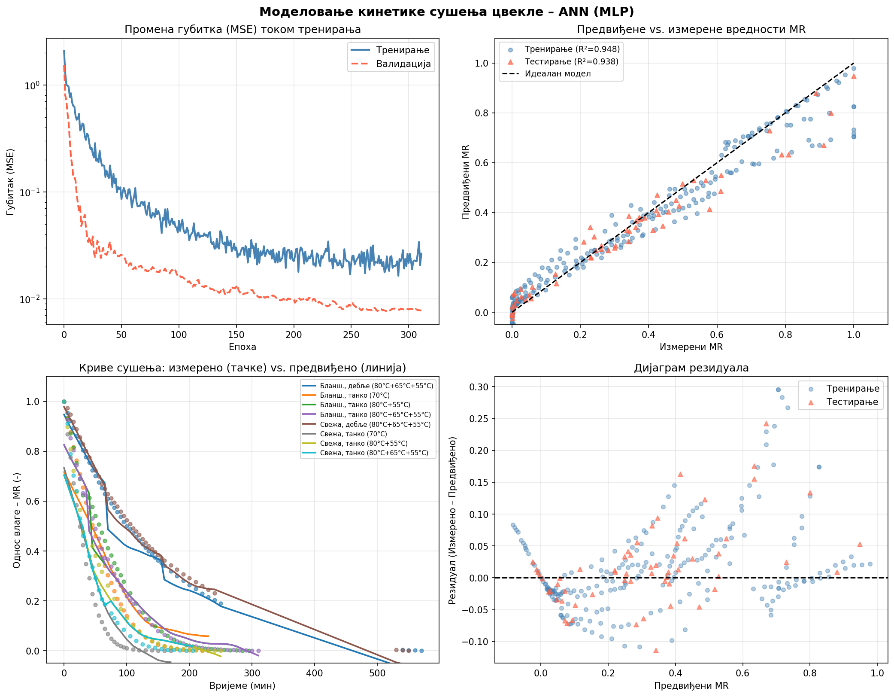
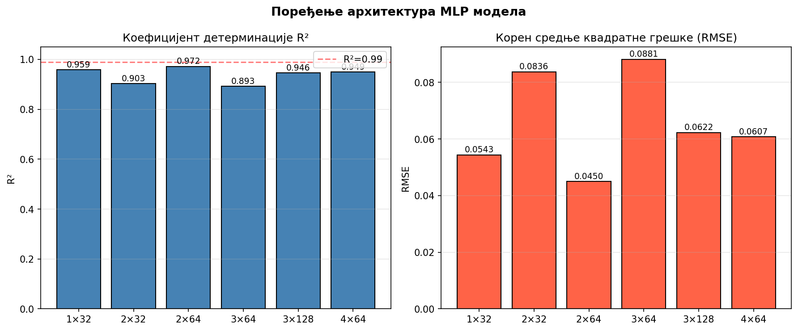

# Beetroot Drying Kinetics Prediction Using Artificial Neural Networks

Artificial Neural Network (ANN) model for predicting the moisture ratio
(MR) during beetroot drying under different experimental conditions.

## Overview

This project investigates the application of a Multilayer Perceptron (MLP)
neural network for modeling the drying kinetics of beetroot.

The model predicts the moisture ratio (MR) based on:

- Drying time
- Temperature
- Blanching condition
- Slice thickness

## Dataset

The dataset contains experimental measurements obtained from
8 beetroot drying experiments with different drying conditions.

The experimental variables include:

- Time (min)
- Temperature (°C)
- Sample mass (g)
- Blanching condition
- Slice thickness

The moisture ratio was calculated as:

MR = (M_t - M_e) / (M_0 - M_e)

where:

- M_t – sample mass at time t
- M_0 – initial sample mass
- M_e – equilibrium/final sample mass

## Model Architecture

The main MLP model consists of:
```
Input (4)
↓
Dense (64, ReLU)
↓
Batch Normalization
↓
Dropout (0.2)
↓
Dense (64, ReLU)
↓
Batch Normalization
↓
Dropout (0.2)
↓
Dense (64, ReLU)
↓
Batch Normalization
↓
Dropout (0.2)
↓
Output (1, Linear)
```
## Training

- Optimizer: Adam
- Learning rate: 0.001
- Loss function: Mean Squared Error (MSE)
- Batch size: 16
- Maximum epochs: 500
- Early stopping
- ReduceLROnPlateau
- Dropout: 0.2
- Batch Normalization
- Feature scaling: StandardScaler

## Results

The main model achieved:

| Dataset | R² | RMSE | MAE |
|---------|----|------|-----|
| Training | 0.9482 | 0.0717 | 0.0493 |
| Testing | 0.9383 | 0.0668 | 0.0451 |

## Architecture Comparison

Several MLP architectures were evaluated:

| Architecture | R² | RMSE |
|--------------|----|------|
| 1×32 | 0.9592 | 0.0543 |
| 2×32 | 0.9032 | 0.0836 |
| 2×64 | 0.9720 | 0.0450 |
| 3×64 | 0.8926 | 0.0881 |
| 3×128 | 0.9464 | 0.0622 |
| 4×64 | 0.9490 | 0.0607 |

The 2×64 architecture achieved the best performance among the
tested architectures in this experiment.

## Visualizations

### Model Performance



### Architecture Comparison



## Technologies

- Python
- TensorFlow / Keras
- NumPy
- Pandas
- Scikit-learn
- Matplotlib
- OpenPyXL

## How to Run

Clone the repository:
```bash
git clone https://github.com/urosmilosevic01/beetroot-drying-kinetics-ml.git
```
Install dependencies:
```bash
pip install -r requirements.txt
```
Run:
```bash
python src/susenje_cvekle_ANN.py
```
## Project Context

This project was developed as part of a Bachelor's thesis on:

"Modeling Beetroot Drying Kinetics Using Artificial Neural Networks."

## Author

Uroš Milošević
